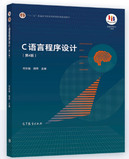
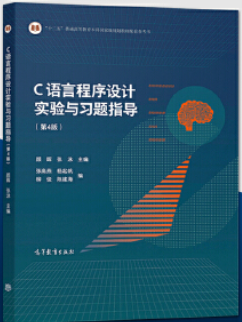

## 参考教材

|            教材             |                            图片                             |    作者     |
| :-------------------------: | :---------------------------------------------------------: | :---------: |
|   C语言程序设计（第4版）    |  | 何钦铭 颜晖 |
| C语言程序设计实验与习题指导 |  |  颜晖 张泳  |

------

## 文件说明

- Source：存放《C语言程序设计》（第4版）教材源码

- Supplement：存放PPT、教学方案和PTA题目集

- Primary：存放主教材《C语言程序设计（第4版）》课后习题，已在PTA平台上测试通过

- Lab：存放实验教材《C语言程序设计实验与习题指导》课程实验，已在PTA平台上测试通过

- 实验调试源程序：存放实验教材上所需的调试程序

------

## 其他资源

- 中国大学慕课MOOC(<a href="https://www.icourse163.org/course/ZJU-199001">程序设计入门</a>、<a href="https://www.icourse163.org/course/ZJU-200001">C语言程序设计进阶</a>)

- <a href="https://pintia.cn/home">PTA(配套编程练习平台)</a>

